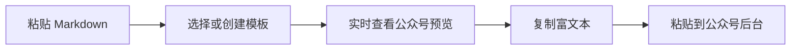

<div align="center">

# 字里 · 公众号排版工作台

**把 Markdown 实时排成可直接粘贴到微信公众号编辑器的精致富文本**

六套原版组件库 · 智能文章骨架 · 实时双栏预览 · 可视化模板设计器 · 一键复制到公众号

[](https://www.gnu.org/licenses/agpl-3.0.html)
[](https://react.dev/)
[](https://vite.dev/)
[](https://commonmark.org/)

</div>

> [!IMPORTANT]
> 本项目的六套内置公众号模板、主题设计体系与公众号兼容思路来源于 [isjiamu/gzh-design-skill](https://github.com/isjiamu/gzh-design-skill)。原项目由 **甲木 ×「摸鱼小李」** 联名共建，排版组件、主题设计与质量标准凝聚了两位作者的公众号实践与共同打磨。

## 项目介绍

`字里` 是一个面向微信公众号创作者的可视化 Markdown 排版网站。

你可以在浏览器中粘贴或编写 Markdown，选择文章模板，实时查看公众号手机端效果，最后点击一次按钮复制富文本，直接粘贴到微信公众号后台发布。

它将 [gzh-design-skill](https://github.com/isjiamu/gzh-design-skill) 中偏 Agent / 文件工作流的排版能力，转换成了普通用户也可以直接操作的 Web 工作台。六套原始主题组件文档、通用组件库、主题索引与官方校验脚本均已纳入本仓库；运行时会直接解析原始组件库并按照不同主题的文章骨架装配 HTML。



## ✨ 核心功能

- **原版主题组件库**：运行时直接读取六套 `theme-*.md` 和 `common-components.md`，保留真实组件 HTML、设计变量、文章骨架与映射规范。
- **完整文章骨架**：根据主题自动装配杂志封面 / 票据封面 / 内刊头图、引言卡、三项精选目录、章节标题、正文、结尾分割线与作者互动区。
- **Markdown 实时排版**：标题、段落、加粗、高亮、下划线、引用、列表、代码块、表格、链接、图片与 GIF 实时转换。
- **六套完整主题**：摸鱼绿、红白编辑、石墨极简、留白禅意、摸鱼票据、橄榄手记，分别加载自身原版组件体系。
- **智能关键词标记**：自动识别正文关键短语，按原主题索引规定的颜色与字重添加公众号兼容下划线。
- **智能章节与目录**：提取前 3 个核心章节生成目录，自动编排章节编号与英文标签，结语切换为 `∞` / `///`。
- **完整强调语法**：支持 `**加粗**`、`==高亮==`、`++下划线++`、`<u>下划线</u>`、`~~删除线~~` 与行内代码。
- **真实表格和 GIF**：GFM 表格保留完整 `table / thead / tbody` 结构，GIF 自动增加「GIF 动图」角标。
- **紧凑代码组件**：使用原 skill 的三色顶栏和逐行代码结构，不使用容易导致公众号空白异常的 `white-space:pre`。
- **作者署名合并**：识别原文末尾作者签名，也可以手动设置作者与简介，自动生成主题专属互动区。
- **实时兼容校验**：检查禁用标签、定位方式、`span leaf`、遗留占位符和代码块兼容结构。
- **公众号手机预览**：在编辑过程中直接查看接近公众号阅读页的实际效果。
- **一键复制富文本**：同时写入 `text/html` 和 `text/plain`，可直接粘贴到公众号后台。
- **全内联样式**：输出正文不依赖外部样式表，降低粘贴后格式丢失的概率。
- **可视化模板设计器**：独立配置主标题、章节标题、编号方式、引用组件、阅读密度和颜色。
- **模板实时预览**：创建模板时，右侧使用真实渲染器即时展示完整示例文章。
- **自定义模板持久化**：创建的模板保存在浏览器本地，刷新页面后仍可继续使用。
- **HTML 导出**：将排版后的完整文章保存为 HTML 文件。
- **写作辅助**：Markdown 工具栏、撤销/重做、自动保存、字数统计与专注模式。
- **响应式界面**：支持桌面端三栏工作台和移动端编辑/预览切换。

## 🎨 六套内置模板

六套模板来自 [gzh-design-skill](https://github.com/isjiamu/gzh-design-skill) 的主题体系：

| 模板 | 主色 | 推荐场景 |
| --- | --- | --- |
| 摸鱼绿 | `#059669` | 教程、测评、清单、工具盘点 |
| 红白编辑 | `#DC2626` | 深度分析、观点与力量感话题 |
| 石墨极简 | `#52525B` | 设计、科技评论、专业观点、高端品牌 |
| 留白禅意 | `#4A5D52` | 极简生活、深度随笔、安静叙事 |
| 摸鱼票据 | `#059669` | 工具对比、创意评测、产品清单 |
| 橄榄手记 | `#1E1F23` | 内刊手记、案例复盘、深度评测 |

> 原始主题的完整组件库已经随项目保存在 `src/skill/references/`，项目直接消费这些文件；完整设计说明仍可阅读 [gzh-design-skill 原仓库](https://github.com/isjiamu/gzh-design-skill)。

## 🧩 创建自己的模板

点击左侧模板栏底部的「添加模板」，即可创建六套内置模板之外的新模板。

模板设计器支持独立设置：

| 组件 | 可选规则 |
| --- | --- |
| 原版组件体系 | 摸鱼绿、红白编辑、石墨极简、留白禅意、摸鱼票据、橄榄手记 |
| 主标题 | 编辑横线、左侧色条、整块卡片、居中留白 |
| 章节标题 | 左侧锚点、深色标题、下划线、居中章节 |
| 章节编号 | `01 /`、`第一章`、`NO.01`、不编号 |
| 引用组件 | 浅色卡片、左侧引线、居中金句、深色摘要 |
| 阅读密度 | 紧凑、标准、舒展 |
| 视觉变量 | 主题色、正文色、卡片底色 |

创建过程中，右侧会使用与最终文章相同的完整组件渲染器，实时展示封面、目录、引言、编号章节、正文强调和作者互动区。保存后，新模板会作为独立模板加入模板列表，并保留所选原始组件体系及其重新配色后的 HTML 组件。

## 🧠 智能排版控制

写作区上方提供五个实时开关：

- **封面**：按主题生成杂志封面、票据封面、内刊头图或编辑式文章刊头。
- **引言**：识别开头的 `>` 引用并生成主题专属引言卡。
- **目录**：从 `##` 章节中提取最多三个看点。
- **关键词**：自动识别正文重点并应用主题专属下划线。
- **署名**：识别或填写作者信息，合并生成文章末尾互动区。

点击设置按钮还可以填写作者署名、一句话简介，并开关中文标点规范化。

## 🚀 快速开始

### 环境要求

- [Node.js](https://nodejs.org/) `^20.19.0` 或 `>=22.12.0`
- npm 9 或更高版本

### 本地开发

```bash
# 克隆或下载本仓库后进入项目目录
cd gzh-design-web
npm install
npm run dev
```

浏览器访问：

```text
http://localhost:5173
```

### 生产构建

```bash
npm run build
```

构建产物会生成在 `dist/` 目录。

### 本地预览生产构建

```bash
npm run preview
```

## 📖 使用流程

1. 将 Markdown 文章粘贴到写作区。
2. 从左侧选择一套内置模板，或创建自己的模板。
3. 在右侧检查手机端文章效果。
4. 根据需要调整 Markdown、模板和阅读宽度。
5. 点击右上角「复制到公众号」。
6. 打开微信公众号后台编辑器并直接粘贴。

也可以点击「导出 HTML」，保存一份独立的排版结果。

## 📝 支持的 Markdown

````markdown
# 文章标题

> 一段需要被强调的引言或核心观点。

## 第一章节

这是正文，支持 **加粗关键词**、*斜体*、`行内代码` 和链接。

支持 ==渐变高亮==、++关键词下划线++、<u>HTML 下划线</u> 和 ~~旧观点~~。

- 无序列表
- 第二个列表项

1. 有序步骤
2. 第二个步骤

| 功能 | 效果 |
| --- | --- |
| GFM 表格 | 自动套用主题表格样式 |
| GIF 动图 | 自动增加动图角标 |


```js
console.log('Hello WeChat');
```
````

项目使用 [Marked](https://marked.js.org/) 解析 Markdown，并使用 [DOMPurify](https://github.com/cure53/DOMPurify) 对生成内容进行清理。

## 🧩 公众号兼容策略

微信公众号编辑器会过滤部分 HTML 和 CSS。为了尽量保持复制后的排版效果，本项目对文章输出做了以下约束：

- 样式尽量写入元素的 `style` 属性。
- 正文使用语义化的 `section`、`h1`、`h2`、`p`、`blockquote`、`ul` 等标签。
- 文本节点使用 `<span leaf="">` 包裹。
- 代码块逐行使用 `<p><span leaf="">...</span></p>`，不使用 `white-space:pre`。
- 真实表格保留标准 `table / thead / tbody / tr / th / td` 语义。
- 输出正文不包含 `<style>`、`<script>` 和用于页面布局的 `<div>`。
- 不在文章正文中依赖 `class`、`id`、CSS 变量或外部字体。
- 复制时同时提供 HTML 富文本和纯文本格式。
- 页面实时运行公众号兼容检查，并保留原 skill 官方的组件库与最终 HTML 校验脚本。

> 不同公众号后台版本、浏览器和第三方插件可能存在差异。正式发布前建议在公众号编辑器中再次检查图片、代码块和长列表。

## 🛠 技术栈

| 技术 | 用途 |
| --- | --- |
| React | 编辑器、模板选择和状态管理 |
| Vite | 本地开发与生产构建 |
| Marked | Markdown 解析 |
| DOMPurify | HTML 内容清理 |
| Lucide React | 界面图标 |
| Clipboard API | 富文本复制 |
| Local Storage | 草稿与自定义模板持久化 |

## 📁 项目结构

```text
gzh-design-web/
├── src/
│   ├── App.jsx                    # 工作台与模板设计器
│   ├── main.jsx                   # 应用入口
│   ├── styles.css                 # 网站界面样式
│   ├── lib/
│       ├── themes.js              # 六套内置主题与权威颜色定义
│       ├── skillSources.js        # 原版组件库解析、组件检索与统计
│       └── renderMarkdown.js      # 完整文章骨架 + 智能 Markdown 排版引擎
│   └── skill/
│       ├── SKILL.md               # 原始公众号排版工作流
│       ├── assets/                # 原始示例文章
│       └── references/
│           ├── theme-index.md     # 六套主题与权威下划线规则
│           ├── theme-*.md         # 六套完整原版主题组件库
│           ├── common-components.md
│           └── theme-generator.md
├── scripts/
│   ├── component_lint.py          # 原版组件源头校验
│   └── validate_gzh_html.py       # 原版 HTML 产物校验
├── index.html
├── package.json
├── README.md
├── LICENSE                        # 原项目 GNU AGPL-3.0 协议
└── dist/                          # 生产构建产物
```

## 📜 可用命令

| 命令 | 说明 |
| --- | --- |
| `npm run dev` | 启动本地开发服务器 |
| `npm run build` | 构建生产版本 |
| `npm run preview` | 本地预览生产构建 |
| `npm run check:components` | 使用原 skill 官方脚本校验所有已接入组件库 |
| `npm run check:html` | 从标准输入读取 HTML 并运行原 skill 官方校验 |

## 🔍 与 gzh-design-skill 的关系

[gzh-design-skill](https://github.com/isjiamu/gzh-design-skill) 是面向 Claude Code、Codex、Cursor 等 AI Agent 的公众号排版 Skill，包含主题组件库、Agent 工作流、主题生成器和确定性校验脚本。

本项目完整收录并直接加载原 skill 的六套主题组件文档、通用组件库、主题索引、主题生成规范及官方校验脚本，是其公众号排版能力的可视化 Web 实现，重点解决：

- 不使用 Agent 也能完成公众号排版。
- 在一个界面内编辑 Markdown、切换模板并实时预览。
- 通过浏览器直接复制公众号富文本。
- 用可视化组件规则创建新的文章模板。
- 不脱离原始组件库的前提下，为每套主题实时装配完整文章骨架。
- 在浏览器中自动执行关键词标记、章节编号、目录提取、署名合并及公众号兼容检查。

本项目不是 `gzh-design-skill` 官方仓库的替代品。原始 Agent 工作流、Word / PDF 输入归一化、基于自然语言或参考图生成全新 45～75 个组件的能力，仍以原项目为准；本网站专注将其 Markdown 文章排版与主题组件能力完整落地到浏览器。

## 🙏 致谢与来源声明

本项目的六套内置模板、主题设计思路和公众号兼容方法来源于：

- [isjiamu/gzh-design-skill](https://github.com/isjiamu/gzh-design-skill)
- 原项目作者：**甲木 ×「摸鱼小李」**
- 原项目协议：[GNU AGPL-3.0](https://github.com/isjiamu/gzh-design-skill/blob/main/LICENSE)

感谢原作者将公众号排版组件、主题方法和实践经验开放出来。本项目在此基础上进行 Web 可视化实现，并保留来源说明与署名。

## 📄 License

本项目按照 **GNU Affero General Public License v3.0（AGPL-3.0）** 发布。

这意味着：

1. 必须保留原项目及本项目的版权与署名信息。
2. 修改、分发或二次开发版本应继续以 AGPL-3.0 或兼容协议开源。
3. 将修改版本作为网络服务提供时，也需要向服务使用者提供对应源代码。

请同时遵守 [gzh-design-skill 的许可证与署名要求](https://github.com/isjiamu/gzh-design-skill/blob/main/LICENSE)。

---
